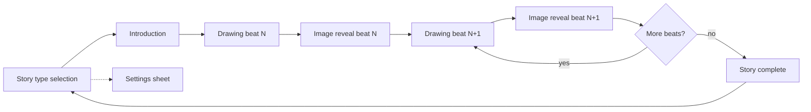

# ScribbleTale — UX & UI replication guide

This document describes the **user journey**, **key screens**, and **visual/UI patterns** in ScribbleTale so another team can rebuild the same experience in a different codebase. Snippets are taken from this repo’s SwiftUI implementation; adapt names and data models as needed.

---

## Platform & architecture (UX-relevant)

- **Stack:** SwiftUI, `NavigationStack`, shared `@Observable` coordinator injected with `.environment(...)`.
- **Back navigation:** Story beats hide the system back button (`navigationBarBackButtonHidden(true)`). Users move forward via primary CTAs; “home” is only explicit on the final screen.
- **Theming:** Global accents lean **purple**; each **story genre** (`StoryType`) supplies a **primary color** and **two-stop gradient** used on cards, backgrounds, and buttons.

---

## User flow




1. **Home:** Choose LLM (local vs cloud), wait for load, pick a **genre card** → creates `Story` and pushes **Introduction**.
2. **Introduction:** LLM generates opening (+ optional “thinking” UI). Primary button label may become **“Draw {subject}!”** (dynamic) → **Drawing** for beat `0`.
3. **Drawing:** User draws from a **prompt**; **“Let’s go!”** enabled only after strokes exist → **Image reveal** for same beat.
4. **Image reveal:** Animated placeholder while image generates; then **caption** (serif, secondary) and **bridge** (serif, title2) stream in; **Continue** goes to next drawing or **Story complete**.
5. **Story complete:** Scrollable recap (opening + per-beat cards) → **New story** clears stack to home.
6. **Settings** (gear on home): Form-based sheet for image provider, generation strategy, API key.

Coordinator destinations (for parity with navigation):

```21:26:ScribbleTale/Navigation/StoryFlowCoordinator.swift
    enum Destination: Hashable {
        case introduction
        case drawing(chapterIndex: Int)
        case imageReveal(chapterIndex: Int)
        case storyComplete
    }
```

App shell wiring:

```15:36:ScribbleTale/ScribbleTaleApp.swift
struct ContentView: View {
    @Environment(StoryFlowCoordinator.self) private var coordinator

    var body: some View {
        @Bindable var coordinator = coordinator

        NavigationStack(path: $coordinator.path) {
            StoryTypeSelectionView()
                .navigationDestination(for: StoryFlowCoordinator.Destination.self) { destination in
                    switch destination {
                    case .introduction:
                        IntroductionView()
                    case .drawing(let chapterIndex):
                        DrawingView(chapterIndex: chapterIndex)
                    case .imageReveal(let chapterIndex):
                        ImageRevealView(chapterIndex: chapterIndex)
                    case .storyComplete:
                        StoryCompleteView()
                    }
                }
        }
    }
}
```

---

## Design tokens (genre + global)

### Global marketing header (home)

- Title **“ScribbleTale”**: rounded, bold, **42pt**, fill = horizontal gradient **purple → pink → orange**.
- Subtitle: **title3**, **secondary**.

### Genre (`StoryType`) visuals

Each genre has `icon` (SF Symbol), `color`, `gradientColors` (2 stops), and `tagline`:

```3:55:ScribbleTale/Models/StoryType.swift
enum StoryType: String, CaseIterable, Identifiable, Codable, Sendable {
    case fantasy = "Fantasy"
    case adventure = "Adventure"
    case celebrity = "Celebrity"
    case friendship = "Friendship"
    case mystery = "Mystery"
    case space = "Space"

    var id: String { rawValue }

    var icon: String {
        switch self {
        case .fantasy: "wand.and.stars"
        case .adventure: "figure.hiking"
        case .celebrity: "star.fill"
        case .friendship: "heart.fill"
        case .mystery: "magnifyingglass"
        case .space: "sparkles"
        }
    }

    var color: Color {
        switch self {
        case .fantasy: .purple
        case .adventure: .orange
        case .celebrity: .pink
        case .friendship: .red
        case .mystery: .indigo
        case .space: .cyan
        }
    }

    var gradientColors: [Color] {
        switch self {
        case .fantasy: [.purple, .blue]
        case .adventure: [.orange, .yellow]
        case .celebrity: [.pink, .purple]
        case .friendship: [.red, .pink]
        case .mystery: [.indigo, .gray]
        case .space: [.cyan, .blue]
        }
    }

    var tagline: String {
        switch self {
        case .fantasy: "Magic & wonder"
        case .adventure: "Daring quests"
        case .celebrity: "Fame & spotlight"
        case .friendship: "Bonds that last"
        case .mystery: "Clues & secrets"
        case .space: "Beyond the stars"
        }
    }
}
```

### Repeated UI metrics


| Element                     | Pattern                                                                                                                                                                                                  |
| --------------------------- | -------------------------------------------------------------------------------------------------------------------------------------------------------------------------------------------------------- |
| Primary CTA                 | Full width, **title2** or **title3**, **rounded bold**, white text, fill = `storyType.color` (or `.purple` fallback), `RoundedRectangle(cornerRadius: 20)`, shadow `color.opacity(0.4), radius: 8, y: 4` |
| Cards / panels              | `RoundedRectangle(cornerRadius: 16–24)`, often `.ultraThinMaterial` or gradient fill                                                                                                                     |
| Story body text (streaming) | `.serif` — **title2** for main beat text, **body** for captions, **title3** for recap                                                                                                                    |
| Chrome / labels             | `.rounded` design consistently                                                                                                                                                                           |
| Disabled CTA                | Gray fill ~`0.4` opacity                                                                                                                                                                                 |


---

## Screen 1 — Story type selection (home)

**UX**

- Scrollable column: **header** → **horizontal model picker** → **2-column genre grid** → **loading** or **readiness summary**.
- Trailing toolbar: **gear** (purple) opens settings sheet.
- Genre cards disabled (dimmed) until the text model is loaded.
- Model cards: fixed width **170**, selected state = purple gradient + white text.

**Background**

```swift
LinearGradient(
    colors: [Color(.systemBackground), Color.purple.opacity(0.05)],
    startPoint: .top,
    endPoint: .bottom
)
```

**Header + grid excerpt**

```82:152:ScribbleTale/Views/StoryTypeSelectionView.swift
    private var header: some View {
        VStack(spacing: 8) {
            Text("ScribbleTale")
                .font(.system(size: 42, weight: .bold, design: .rounded))
                .foregroundStyle(
                    LinearGradient(
                        colors: [.purple, .pink, .orange],
                        startPoint: .leading,
                        endPoint: .trailing
                    )
                )

            Text("Pick your story!")
                .font(.system(.title3, design: .rounded))
                .foregroundStyle(.secondary)
        }
        .padding(.top, 20)
    }
    // ...
    private var genreGrid: some View {
        LazyVGrid(columns: columns, spacing: 16) {
            ForEach(StoryType.allCases) { type in
                StoryTypeCard(storyType: type) {
                    coordinator.startStory(type: type)
                }
                .disabled(isModelLoading || !coordinator.storyEngine.isLoaded)
                .opacity(isModelLoading || !coordinator.storyEngine.isLoaded ? 0.6 : 1.0)
            }
        }
    }
```

**Genre card component**

```9:43:ScribbleTale/Components/StoryTypeCard.swift
        Button(action: action) {
            VStack(spacing: 12) {
                Image(systemName: storyType.icon)
                    .font(.system(size: 40))
                    .foregroundStyle(.white)
                    .shadow(color: .black.opacity(0.2), radius: 2, y: 1)

                Text(storyType.rawValue)
                    .font(.system(.title2, design: .rounded, weight: .bold))
                    .foregroundStyle(.white)

                Text(storyType.tagline)
                    .font(.system(.caption, design: .rounded))
                    .foregroundStyle(.white.opacity(0.85))
            }
            .frame(maxWidth: .infinity)
            .padding(.vertical, 24)
            .background(
                LinearGradient(
                    colors: storyType.gradientColors,
                    startPoint: .topLeading,
                    endPoint: .bottomTrailing
                ),
                in: RoundedRectangle(cornerRadius: 24)
            )
            .shadow(color: storyType.color.opacity(0.4), radius: 8, y: 4)
        }
        .buttonStyle(.plain)
        .scaleEffect(isPressed ? 0.95 : 1.0)
```

**Readiness panel** (when idle): frosted rounded rect, per-line check / xmark:

```198:213:ScribbleTale/Views/StoryTypeSelectionView.swift
    private var availabilitySummary: some View {
        VStack(spacing: 6) {
            availabilityLine(
                title: "Story Engine (\(selectedModel.displayName))",
                available: coordinator.storyEngine.isLoaded,
                error: coordinator.storyEngine.loadError
            )
            availabilityLine(
                title: coordinator.config.imageProvider.displayName,
                available: coordinator.imageService.isAvailable,
                error: nil
            )
        }
        .padding(12)
        .background(.ultraThinMaterial, in: RoundedRectangle(cornerRadius: 16))
    }
```

---

## Screen 2 — Introduction

**UX**

- Full-screen **tinted gradient** from genre colors at low opacity (15%).
- Large **genre icon** (60pt) with pulse while generating; genre name as **largeTitle** in genre color.
- While generating: **ThinkingTextView** (expandable “Thinking…”) + optional `ProgressView` + “Creating your story…”.
- Opening paragraph appears via **StreamingText** (serif **title2**).
- Bottom CTA slides up; label defaults to **“Let’s draw!”** or **“Draw {subject}!”** after challenge is known.

**Layout shell**

```12:50:ScribbleTale/Views/IntroductionView.swift
    var body: some View {
        ZStack {
            backgroundGradient

            VStack(spacing: 0) {
                Spacer()

                storyContent

                if let errorMessage {
                    Text(errorMessage)
                        .font(.system(.callout, design: .rounded))
                        .foregroundStyle(.red)
                        .padding()
                }

                Spacer()

                if showButton {
                    letsGoButton
                        .transition(.move(edge: .bottom).combined(with: .opacity))
                }
            }
            .padding(24)
        }
        .navigationBarBackButtonHidden(true)
        .task {
            await generateIntro()
        }
    }

    private var backgroundGradient: some View {
        LinearGradient(
            colors: coordinator.story.map { $0.storyType.gradientColors.map { $0.opacity(0.15) } } ?? [.clear],
            startPoint: .topLeading,
            endPoint: .bottomTrailing
        )
        .ignoresSafeArea()
    }
```

**Primary button styling**

```94:110:ScribbleTale/Views/IntroductionView.swift
    private var letsGoButton: some View {
        Button {
            coordinator.goToDrawing(chapterIndex: 0)
        } label: {
            Text(buttonLabel)
                .font(.system(.title2, design: .rounded, weight: .bold))
                .foregroundStyle(.white)
                .frame(maxWidth: .infinity)
                .padding(.vertical, 16)
                .background(
                    coordinator.story?.storyType.color ?? .purple,
                    in: RoundedRectangle(cornerRadius: 20)
                )
                .shadow(color: (coordinator.story?.storyType.color ?? .purple).opacity(0.4), radius: 8, y: 4)
        }
        .padding(.bottom, 8)
    }
```

**Streaming text component** (center-aligned serif)

```23:34:ScribbleTale/Components/TypewriterText.swift
struct StreamingText: View {
    let text: String
    var font: Font = .system(.title2, design: .serif)
    var color: Color = .primary

    var body: some View {
        Text(text)
            .font(font)
            .foregroundStyle(color)
            .multilineTextAlignment(.center)
    }
}
```

**“Thinking” affordance**

```16:52:ScribbleTale/Components/ThinkingTextView.swift
    var body: some View {
        if !text.isEmpty {
            VStack(alignment: .leading, spacing: 6) {
                Button {
                    withAnimation(.easeInOut(duration: 0.2)) {
                        isExpanded.toggle()
                    }
                } label: {
                    HStack(spacing: 4) {
                        Image(systemName: "brain.head.profile")
                            .font(.system(.caption2))
                            .symbolEffect(.pulse, isActive: true)
                        Text("Thinking…")
                            .font(.system(.caption2, design: .rounded, weight: .semibold))
                        Image(systemName: isExpanded ? "chevron.up" : "chevron.down")
                            .font(.system(size: 8, weight: .bold))
                    }
                    .foregroundStyle(.purple.opacity(0.6))
                }
                .buttonStyle(.plain)

                if isExpanded {
                    ScrollView {
                        Text(displayText)
                            .font(.system(.caption, design: .monospaced))
                            .italic()
                            .foregroundStyle(.secondary.opacity(0.7))
                            .frame(maxWidth: .infinity, alignment: .leading)
                    }
                    .frame(maxHeight: 120)
                    .padding(8)
                    .background(.ultraThinMaterial, in: RoundedRectangle(cornerRadius: 8))
                    .transition(.opacity.combined(with: .scale(scale: 0.95, anchor: .top)))
                }
            }
            .padding(.horizontal, 8)
        }
    }
```

---

## Screen 3 — Drawing (per beat)

**UX**

- **Progress bar:** row of **capsules** (height 4); completed beats use genre color; current beat **50% opacity**; future **systemGray4**.
- **Toolbar title:** “Beat **n** of **total**” (rounded headline).
- **Prompt:** **title2 rounded bold**, centered, full width.
- **Canvas:** white, **16pt corner radius**, light shadow; uses PencilKit via `DrawingCanvas`.
- **Toolbar:** frosted rounded panel — color dots (32pt), eraser toggle, line width slider, undo/redo/clear.
- **CTA “Let’s go!”** — same shape as intro; **disabled + gray** until `hasDrawn`.

**Structure**

```24:62:ScribbleTale/Views/DrawingView.swift
    var body: some View {
        VStack(spacing: 0) {
            chapterProgressBar
            VStack(spacing: sectionSpacing) {
                promptBanner
                canvas
                toolbar
                letsGoButton
            }
        }
        .background(Color(.systemGroupedBackground))
        .navigationBarBackButtonHidden(true)
        .toolbar {
            ToolbarItem(placement: .principal) {
                Text("Beat \(chapterIndex + 1) of \(coordinator.story?.chapterCount ?? 5)")
                    .font(.system(.headline, design: .rounded))
            }
        }
    }

    private var chapterProgressBar: some View {
        HStack(spacing: 6) {
            let totalBeats = coordinator.story?.chapterCount ?? 5
            ForEach(0..<totalBeats, id: \.self) { i in
                Capsule()
                    .fill(
                        i < chapterIndex
                            ? (coordinator.story?.storyType.color ?? .purple)
                            : i == chapterIndex
                                ? (coordinator.story?.storyType.color ?? .purple).opacity(0.5)
                                : Color(.systemGray4)
                    )
                    .frame(height: 4)
            }
        }
        .padding(.horizontal, 20)
        .padding(.top, 8)
        .padding(.bottom, 4)
    }
```

**CTA enabled only with strokes**

```116:136:ScribbleTale/Views/DrawingView.swift
    private var letsGoButton: some View {
        Button {
            coordinator.goToImageReveal(chapterIndex: chapterIndex)
        } label: {
            Text("Let's go!")
                .font(.system(.title3, design: .rounded, weight: .bold))
                .foregroundStyle(.white)
                .frame(maxWidth: .infinity)
                .padding(.vertical, 14)
                .background(
                    hasDrawn
                        ? (coordinator.story?.storyType.color ?? .purple)
                        : Color.gray.opacity(0.4),
                    in: RoundedRectangle(cornerRadius: 20)
                )
        }
        .disabled(!hasDrawn)
        .padding(.horizontal, 16)
        .padding(.bottom, 16)
        .animation(.easeInOut(duration: 0.3), value: hasDrawn)
    }
```

**Toolbar pattern**

```17:88:ScribbleTale/Components/DrawingToolbar.swift
    var body: some View {
        VStack(spacing: 12) {
            colorPalette
            controls
        }
        .padding(.horizontal, 16)
        .padding(.vertical, 12)
        .background(.ultraThinMaterial, in: RoundedRectangle(cornerRadius: 20))
    }
    // colors: black, red, orange, yellow, green, blue, purple, brown
    // selected: white stroke ring; eraser highlights with accent fill
```

---

## Screen 4 — Image reveal

**UX**

- Background: genre gradient at **8%** opacity.
- **ScrollView** stack: chapter header (caption + subject in genre color), **image section**, thinking text, **caption** (serif body, secondary), **bridge** (serif title2).
- While generating image: `**TransformingDrawingPlaceholder`** — user’s drawing with **animated angular gradient border**, shimmer band, pulsing blur (see `ImageRevealView.swift` in repo for full ~120 lines).
- Revealed image: rounded 20, shadow; spring animate scale **0.8 → 1** and opacity.
- Bottom **Continue** bar: subtle gradient strip; button text **“Continue the story”** vs **“See your story”** on last beat.

**Continue button**

```211:227:ScribbleTale/Views/ImageRevealView.swift
    private var continueButton: some View {
        Button {
            coordinator.goToNextChapterOrComplete(currentChapterIndex: chapterIndex)
        } label: {
            let totalBeats = coordinator.story?.chapterCount ?? 5
            Text(chapterIndex < totalBeats - 1 ? "Continue the story" : "See your story")
                .font(.system(.title3, design: .rounded, weight: .bold))
                .foregroundStyle(.white)
                .frame(maxWidth: .infinity)
                .padding(.vertical, 14)
                .background(
                    coordinator.story?.storyType.color ?? .purple,
                    in: RoundedRectangle(cornerRadius: 20)
                )
                .shadow(color: (coordinator.story?.storyType.color ?? .purple).opacity(0.4), radius: 8, y: 4)
        }
    }
```

**Caption / bridge typography**

```186:208:ScribbleTale/Views/ImageRevealView.swift
    private var captionSection: some View {
        if !captionText.isEmpty && phase != .generatingImage {
            StreamingText(
                text: captionText,
                font: .system(.body, design: .serif),
                color: .secondary
            )
            .padding(.horizontal, 8)
            .transition(.opacity)
        }
    }

    private var bridgeSection: some View {
        if !bridgeText.isEmpty && (phase == .showingBridge || phase == .complete) {
            StreamingText(
                text: bridgeText,
                font: .system(.title2, design: .serif),
                color: .primary
            )
            .padding(.horizontal, 8)
            .transition(.opacity)
        }
    }
```

---

## Screen 5 — Story complete

**UX**

- Same light genre gradient background as reveal.
- Header: **sparkles** icon with yellow→orange gradient + repeating bounce; **“The End!”** in genre color (~38pt rounded bold); supportive subtitle in secondary.
- **Recap:** opening in serif title3 secondary; then **ForEach** beat cards.
- **Beat card:** frosted `RoundedRectangle(20)`; top row = **Beat n** capsule (white on genre color) + role + subject; image (generated or drawing); caption (callout serif); bridge (title3 serif).
- **New story** button: house icon + label, same CTA styling as other screens.

**Entrance:** content fades in and moves up (`opacity` + `offset` over 0.8s).

```56:77:ScribbleTale/Views/StoryCompleteView.swift
    private var header: some View {
        VStack(spacing: 12) {
            Image(systemName: "sparkles")
                .font(.system(size: 50))
                .foregroundStyle(
                    LinearGradient(
                        colors: [.yellow, .orange],
                        startPoint: .top,
                        endPoint: .bottom
                    )
                )
                .symbolEffect(.bounce, options: .repeating)

            Text("The End!")
                .font(.system(size: 38, weight: .bold, design: .rounded))
                .foregroundStyle(coordinator.story?.storyType.color ?? .purple)

            Text("What an amazing story you created!")
                .font(.system(.body, design: .rounded))
                .foregroundStyle(.secondary)
        }
        .padding(.top, 12)
    }
```

**Beat card layout**

```98:153:ScribbleTale/Views/StoryCompleteView.swift
    private func beatCard(_ beat: StoryBeat, state: NarrativeState, storyType: StoryType) -> some View {
        let beatPlan = state.beatPlan[safe: beat.beatIndex]

        return VStack(spacing: 16) {
            HStack {
                Text("Beat \(beat.beatIndex + 1)")
                    .font(.system(.caption, design: .rounded, weight: .semibold))
                    .foregroundStyle(.white)
                    .padding(.horizontal, 12)
                    .padding(.vertical, 4)
                    .background(storyType.color, in: Capsule())
                if let role = beatPlan?.role {
                    Text(role.rawValue.capitalized)
                        .font(.system(.subheadline, design: .rounded, weight: .medium))
                        .foregroundStyle(.secondary)
                }
                Spacer()
                Text(beat.drawingSubject)
                    .font(.system(.caption2, design: .rounded))
                    .foregroundStyle(.tertiary)
            }
            // ... image, caption, narrative bridge ...
        }
        .padding(16)
        .background(.ultraThinMaterial, in: RoundedRectangle(cornerRadius: 20))
    }
```

Safe array access (used above):

```193:197:ScribbleTale/Models/Chapter.swift
extension Array {
    subscript(safe index: Index) -> Element? {
        indices.contains(index) ? self[index] : nil
    }
}
```

---

## Screen 6 — Settings (sheet)

**UX**

- Modal `NavigationStack` with **Form** sections: Image generation provider, Story generation strategy, OpenAI API key (secure field + show/hide), About / model labels.
- **Done** trailing; purple checkmarks for selected options.

```11:30:ScribbleTale/Views/SettingsSheet.swift
    var body: some View {
        NavigationStack {
            Form {
                imageProviderSection
                generationStrategySection
                openAISection
                aboutSection
            }
            .navigationTitle("Settings")
            .navigationBarTitleDisplayMode(.inline)
            .toolbar {
                ToolbarItem(placement: .topBarTrailing) {
                    Button("Done") { dismiss() }
                        .font(.system(.body, design: .rounded, weight: .semibold))
                }
            }
            .onAppear {
                apiKeyInput = config.openAIKey
            }
        }
    }
```

---

## Motion & feedback summary


| Moment           | Behavior                              |
| ---------------- | ------------------------------------- |
| Genre card press | Scale to **0.95** with spring         |
| Intro CTA        | Slide from bottom + fade              |
| Drawing CTA      | Animate fill when `hasDrawn` flips    |
| Reveal image     | Spring **scale + opacity**            |
| Complete screen  | Fade + **20pt** upward slide          |
| Thinking UI      | Pulse on brain icon; expandable panel |


---

## Porting checklist (non-Swift stacks)

1. **Navigation:** linear stack of routes with no back on beats; reset root on “New story”.
2. **State:** one session object holding `storyType`, beats, drawings, generated images, narrative strings, pending challenge.
3. **Visual hierarchy:** rounded typography for UI chrome; **serif** for story text; purple accents; **genre-driven** CTA and progress colors.
4. **Drawing:** pressure-sensitive ink + eraser + undo + clear; gate primary action on non-empty canvas.
5. **Reveal:** distinguish **loading** (animated treatment on user sketch), **caption** (muted), **bridge** (primary story beat).
6. **Accessibility:** ensure dynamic type and VoiceOver labels for icons-only toolbar buttons if reimplementing.

---

*Generated from the ScribbleTale SwiftUI codebase; file paths are relative to the repository root.*